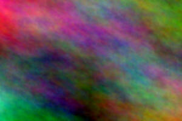

<!--
author:   Theme Showcase
email:    showcase@example.org
version:  1.0.0
language: en
comment:  A course that renders every styleable LiaScript element once,
          used to preview and verify a theme.
-->

# Theme Showcase

This course shows **every styleable element** once, so a theme can be judged
at a glance. Some *emphasis*, ~strike~, ~~underline~~, `inline code`,
a [link](https://liascript.github.io) and a footnote[^1].

[^1]: Footnotes open in a popup.

> A plain blockquote with some thoughtful text.
>
> -- Somebody

## Text, Lists & Tables

Paragraph text with enough words to judge line height and letter width. The
quick brown fox jumps over the lazy dog, again and again, until the line wraps.

1. Ordered item
2. Another item
   - nested bullet
   - another nested bullet

<!-- class="is-alternating" -->
| Column A | Column B | Column C |
| -------- | :------: | -------: |
| alpha    |    1     |     10.0 |
| beta     |    2     |     20.5 |
| gamma    |    3     |     30.1 |
| delta    |    4     |     40.9 |

---

### Heading level 3

#### Heading level 4

##### Heading level 5

###### Heading level 6

## Alerts & Details

> [!NOTE]
> Useful information that users should know.

> [!TIP]
> Helpful advice for doing things better.

> [!IMPORTANT]
> Key information users need to know.

> [!WARNING]
> Urgent info that needs immediate attention.

> [!CAUTION]
> Advises about risks or negative outcomes.

<details>
<summary>Click to expand details</summary>

Hidden content inside a details block.

</details>

## Quizzes & Surveys

Single choice:

- [( )] wrong
- [(X)] right
- [( )] also wrong

Multiple choice:

- [[X]] right
- [[ ]] wrong
- [[X]] also right

Text input: What is 2 + 2?

[[4]]

Selection: [[ one | (two) | three ]]

Survey:

- [(1)] Agree
- [(0)] Disagree

Tasks:

- [ ] open task
- [X] done task

## Code

``` js
// runnable JavaScript
let sum = 0
for (let i = 1; i <= 10; i++) sum += i
console.log("sum:", sum)
sum
```
<script>@input</script>

``` python
# static code block
def greet(name):
    return f"Hello {name}"
```

Keyboard: <kbd>Ctrl</kbd> + <kbd>C</kbd>

## Charts & Media

                                  diagram
    1.9 |                                    *
        |                               *
        |                          *
        |                    *
        |             *
    0.1 |    *
        +------------------------------------
         0                                 10




## Effects & Buttons

    --{{0}}--
This text is read aloud by the narrator.

{{1}}
> Appears on the first click.

{{2}}
This appears on the second click.

<button class="lia-btn">A Button</button>
<button class="lia-btn lia-btn--outline">Outline Button</button>
